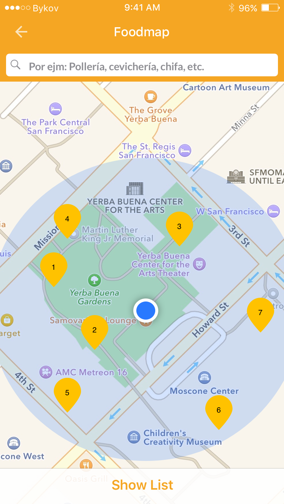
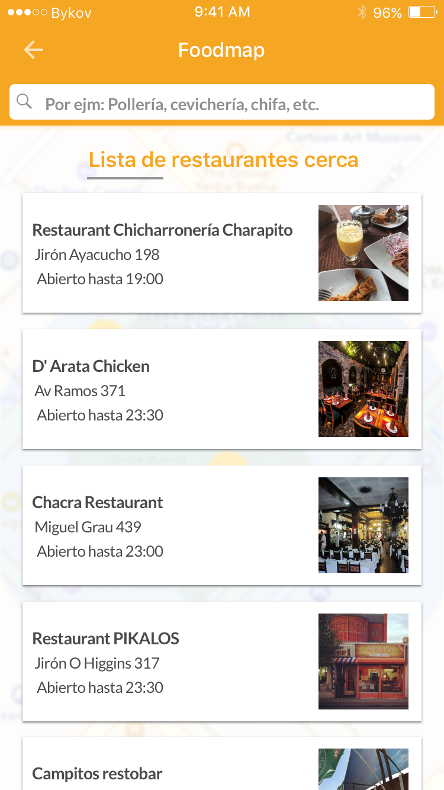
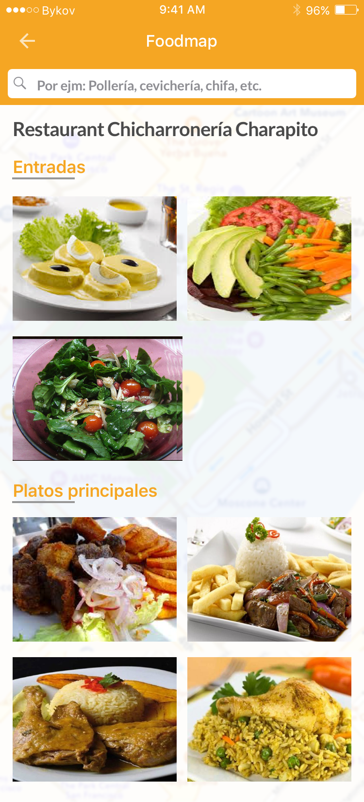
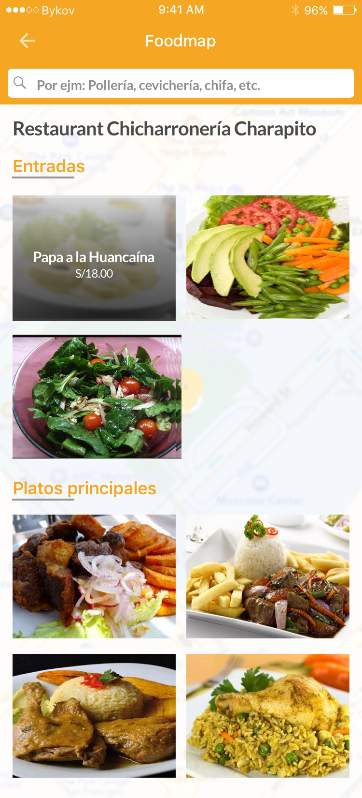
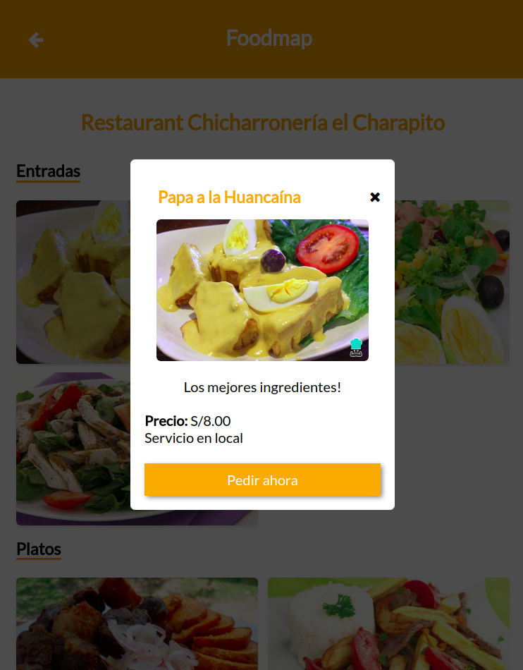

# foodmap
Foodmap es una aplicación web que muestra los restaurante 'cerca de ti', donde puedes seleccionar un plato del restaurante y hacer tu pedido.

## Desarrollado para 
[Laboratoria](http://laboratoria.la)

foodmap
* **Track:** _Common Core_
* **Curso:** _Crea tu propia red social_
* **Unidad:** _3. Agiliza tu desarrollo_
***

En este trabajo se pidió crear una web-app que a través de un input pueda filtrar los restaurantes que se encuentran 'cerca de ti'. La estructura de los datos es libre, de igual manera el diseño.

### Flujos de la aplicación

* Vista splash con duración de 2 a 5 segundos que redirecciona a tu vista principal.  

* En la vista principal se muestran todos los restaurantes "cerca de ti" junto con el input para filtrar tu elección (Los criterios de filtrado son decisión tuya, puede ser por tipo de comida, costos, orden alfabético, etc.). El resultado debe mostrar únicamente aquellos restaurantes que cumplan con la condición. 

* Agregar un evento mouseover a las imágenes, lo que pase con el efecto es decisión tuya (Cambio de tamaño, muestra de texto, cambio de imagen, información, etc).

* Al seleccionar alguno de los restaurantes, deberá mostrarse la información de este a través de un modal. Una vez cerrado el modal debe volver a la vista principal.

### Se utilizó
`HTML` `CSS` `JS` y Jquery.

#### Primero se realizó un rediseño de la estructura de los datos:

* Detecta los restaurantes 'cerca de ti'  

* Muestra todos los restaurantes y puedes filtrar según el tipo de restaurant cómo pollería, chifa, cevicherí, etc.  

* Muestra los platos del restaurante, separado en dos listas como entradas, y plato principal. 

* Al pasar el cursor se muestra el nombre del plato. 

* Puedes seleccionar el plato que desees y hacer tu pedido 

#### Funcionalidad
* Para la funcionalidad se usó Jquery, para llenar la vista HTML de forma dinámica accediendo a la data (data.js), mostrando los restaurantes y los platos que tienen disponibles.
